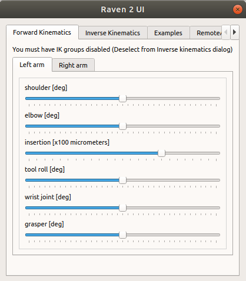
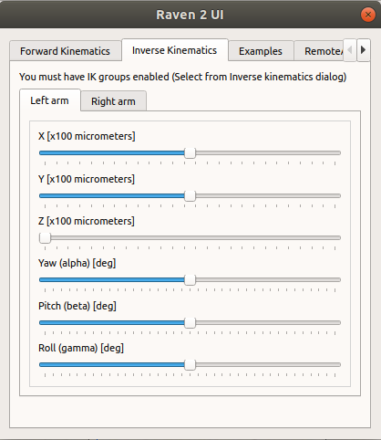

Raven 2 robot in V-REP
======================

Simulation and control of Raven 2 surgical robot in V-REP.

    

The robot was imported to V-REP with the URDP import plugin using the Raven2 URDF provided from the
[raven_2 official repository](https://github.com/rll/raven_2/tree/master/raven_2_params/data)

## Project structure

- python: directory with python code to interact with Raven robot in V-REP via RemoteAPI or ROS
- vrep: directory with the V-REP scene and all objects' Lua scripts

## V-REP Custom UI

### Forward Kinematics

    

### Inverse Kinematics

    

